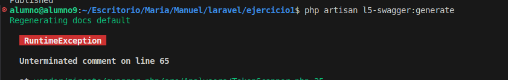
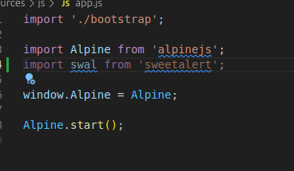

## Mi proyecto de laravel

-   composer update
-   npm install
-   php artisan migrate --> Para migrarlo
-   npm run dev --> para activarlo (Siempre activarlo)
-   php artisan serve --> para sacar la ID donde ver el trabajo actual
-   docker compose up -d --> Una vez implementado la base de datos, siempre hay que levantar el docker

-   composer run dev --> hace el trabajo de los dos
    
    npm run dev
    php artisan serve

## Laravel trabajo iniciar

## Pendientes Resources

-   Css —> app.css
-   Views —>
    -   Auth para el login y el register
    -   Components/layouts —> estructura de la pagina que quiero que se vea en todas las paginas. Creas los estilos de las mismas al tener separado footer header
-   Routes —> web.php

## RUtas del navegador para añadirlas en web.php

## publicarlo gon git

-   npm i -D gh-pages
-   npm run build
-   npm run deploy

## cambiar la ruta una vez que este hecho el login

en web añadimos la rutra de regreso

en app / http / controller y auth ponemos la ruta

## tailwind

en theme editas el tema del ejercicio

## Como pasar atributaos de la pagina a la plantilla

## Delete archivos

### view carpeta profile

-   carpeta completa profile
    

-   carpeta completalayouts
    

-   dashboard.blade.php
-   welcome.blade.php

## Carpeta database

1º Migraciones: - Crear y modificar tablas-
Necesitra estar en un gestion de base de datos.

        Creamos una maquina de doocker, que sera el gestor de la base de datos.(SERVIDOR)

    ### Docker-compose.yaml --> altura general
         Crearemos dos contenedores o servicios relacion 1:1
         - mysql
            - el puerto inicial donde entra y el segundo a donde reconduzco
            - restart always si se cae el serviio regresa
            -enviroment para personalizar la base de datos
                - encerrar entre llaves por si tiene otro caracter
         -phpmyadmin
            - identificador de la otra maquina

en env configuramos el port

-   
-    importante quitar de env las #

Y para hacerlo funcionar docker compose up -d

### limpieza de docker y de mysql

-   Meter en gitgnore mysql y php artisan migrate
    2º factorias--> clases de larabel que me permiten fabricar valoores
    3º Ider clases de laravel que me permite llamar a latabla que me permite gestionar los datos

## el local host

http://localhost:8100/index.php?route=/

alumno alumno

-   php artisan migrate --> importante el mysql tiene que estr en minuscula
    
-   php artisan make:migration AlumnoMigration
    
    

## añadir base de datos

-   a traves de $schema

### $ table ->id hace referencia a 'alumnos

### $ table -> timestamps -> created -at: fecha de creación

                        -> updated -at: ultima vez modificado
                        -> para auditorias create
    Se crea por defecto en laravel y sirve para auditoria
    s

### fabricar valores -- factory

Un Factory es una clase que define cómo crear datos de prueba (fake data) para un modelo. Es muy útil para:

Testing
Seeding (poblar la base de datos con datos de ejemplo)
Desarrollo local

### fabricar coger los valores y meterlos en la base de datos--sider

La relación entre ambos es que el Factory necesita el Modelo para crear instancias de datos, y el Modelo necesita el trait HasFactory para poder usar el Factory.

### modelo

-   se necesita al ser una clase para interactuar en una base de datos concreto

# Ver rutas

-   php artisan route:list --name="alumno"
    

-   Route::get(): Define rutas específicas, generalmente para una sola acción o método (como index(), show(), etc.), y se utiliza cuando necesitas un control preciso sobre las rutas.
-   Route::resource(): Genera automáticamente rutas RESTful para realizar las operaciones CRUD completas (indexar, mostrar, crear, editar, actualizar, eliminar) en el recurso (en este caso, alumnos).

**Route::resource()** se usa para generar automáticamente un conjunto de rutas RESTful para un recurso. Estas rutas cubren todas las operaciones CRUD estándar (Crear, Leer, Actualizar, Eliminar), como se espera en una arquitectura RESTful.

Cuando usas Route::resource(), Laravel crea múltiples rutas para el mismo controlador con métodos específicos para cada operación.

Route::get() se usa para definir rutas específicas que manejan solicitudes HTTP GET en una URL determinada. La ruta get está asociada con una acción o función, y se puede utilizar para manejar un solo tipo de solicitud (en este caso, solicitudes GET).

# Actualizar las bases de datos

## Migraciones

-   php artisan migrate--> CREA TABLAS

## Validar los datos del NUEVO Alumno en back

Store Alumno request

## biblioteca, sweet aletr

queda registrado en package.json

#### ({{ $alumno->id }}, '{{ $alumno->nombre }}')">Eliminar</button>

en public

-   import swal from 'sweetalert';
    

-   en layaout.blade --> traspilar
    Tiene que ser un array. al ser 2 hay que hacerlo en array y ponerlo en [y las " entre medias]
    

## Acceso a ficheros html

-   para acceder a páginas html
-   ./resources/view
-   todas son extensiones **blade.php**
-   Puedo (debo) establecer carpetas para organizarlo
-   Si quiero acceder o referenciar una carpeta
-   > carpeta. nombre

## Controladores

-   Estaán en app/http/controllers
-   El código php que quiero que se ejecute ante una solicitud de una ruta

## Rutas

-   La ruta es la URL que quiero que mi app tenga
-   Las rutas se establecen en ./routes/web.php
-   Se especifican con ROUTE::verbo ("url",...)
-   Para poner nombre o alias a la ruta Route:: verbo ("url", ...)-> name (alumnos.index)
-   para referenciar una ruta por su nombre uso la duncion route("nombre)
-   Las rutas pueden ser parametrizadas (Sobre todo haciendo un crud de un recurso):
    -   Una ruta parametrizada es aquella que en la url hay un parámetro (valor que puede cambaiar), que http://alumnos/1 o http://alumnos/5, donde 1 y 5 son el parámetro
-   Cuando referencio una ruta pro su nombre con la función route, para pasar el parámetro

# CONTRASEÑA DE USUARIO

esta sin hacer ni modificar

# API

-   interface que te permite utilizar un aplicacion. Para ofrecer datos y que el usuario lo consima . Utilizamos Postman.. con especificaciones

-   No se instala se crea. pero pudes poner crear un fichero con una libreria de larabel php artisan api install.
    .sofware intermedio midelware

## Swagger // vendor

-   composer require darkaonline/l5-swagger //descarga la libreria

-   php artisan vendor:publish --provider="L5Swagger\\L5SwaggerServiceProvider" // intala y pone disponible la libreria

-   php artisan l5-swagger:generate

# NOTICIAS

image.png

# como clonar un proyectp de Laravel subido a Git

- Git clone ->http :
 > Tener encuenta que hay ficheros/directorios que no se clonan y los necesito para poner en ejecucion mi ap

 * .env
 * node-modules
 * vendor
 ## .env
  - Lo tengo que crear copiando (cp) .env . example

## mode-modules
- npm install

## vendor
- si la base de datos esq¡ta dojerizada, levanto docker
* docker compose up -d
- instalar la base de datos
* php artisan migrate

# Cambiar idioma
- sudo apt install php-bcmath
- composer require laravel-lang/common
- php artisan lang:publish
- php artisan lang:add en  <!-- cambias el idioma  -->

Se crea una carpeta