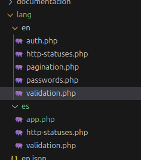

## Mi proyecto de laravel

- composer update
- npm install
- php artisan migrate --> Para migrarlo
- npm run dev --> para activarlo (Siempre activarlo)
- php artisan serve --> para sacar la ID donde ver el trabajo actual

## Laravel trabajo iniciar

## Pendientes Resources
- Css —> app.css
- Views —>
    *   Auth para el login y el register
    * Components/layouts —> estructura de la pagina que quiero que se vea en todas las paginas. Creas los estilos de las mismas al tener separado footer header 
- Routes —> web.php

## RUtas del navegador para añadirlas en web.php

## publicarlo gon git
-  npm i -D gh-pages
- npm run build
- npm run deploy

## cambiar la ruta una vez que este hecho el login

en web añadimos la rutra de regreso

en app / http / controller y auth ponemos la ruta

## tailwind 
en theme editas el tema del ejercicio

## Como pasar atributaos de  la pagina a la plantilla

## Delete archivos
### view carpeta profile
- carpeta completa profile

- carpeta completalayouts

- dashboard.blade.php
-  welcome.blade.php

## Carpeta database

1º Migraciones:
    - Crear y modificar tablas-
        Necesitra estar en un gestion de base de datos.

        Creamos una maquina de doocker, que sera el gestor de la base de datos.(SERVIDOR)

    ### Docker-compose.yaml --> altura general
         Crearemos dos contenedores o servicios relacion 1:1
         - mysql 
            - el puerto inicial donde entra y el segundo a donde reconduzco
            - restart always si se cae el serviio regresa
            -enviroment para personalizar la base de datos
                - encerrar entre llaves por si tiene otro caracter
         -phpmyadmin
            - identificador de la otra maquina
en env configuramos el port

-

-
 importante quitar de env las #

Y para hacerlo funcionar docker compose up -d

### limpieza de docker y de mysql

 

 - Meter en gitgnore mysql y php artisan migrate
2º factorias--> clases de larabel que me permiten fabricar valoores
3º Ider clases de laravel que me permite llamar a latabla que me permite gestionar los datos

## el local host
http://localhost:8100/index.php?route=/

alumno alumno
- php artisan migrate --> importante el mysql tiene que estr en minuscula

- php artisan make:migration AlumnoMigration

## añadir base de datos
- a traves de $schema 

~$ table ->id hace referencia  a 'alumnos
~ $ table -> timestamps -> created -at: fecha de creación
                        -> updated -at: ultima vez modificado
                        -> para auditoriacreate

### fabricar valores -- factory

### fabricar coger los valores y meterlos en la base de datos--sider

### modelo
- se necesita al ser una clase para interactuar en una base de datos concreto